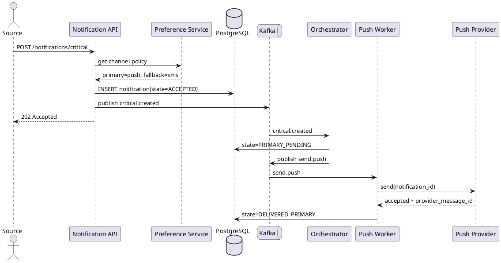
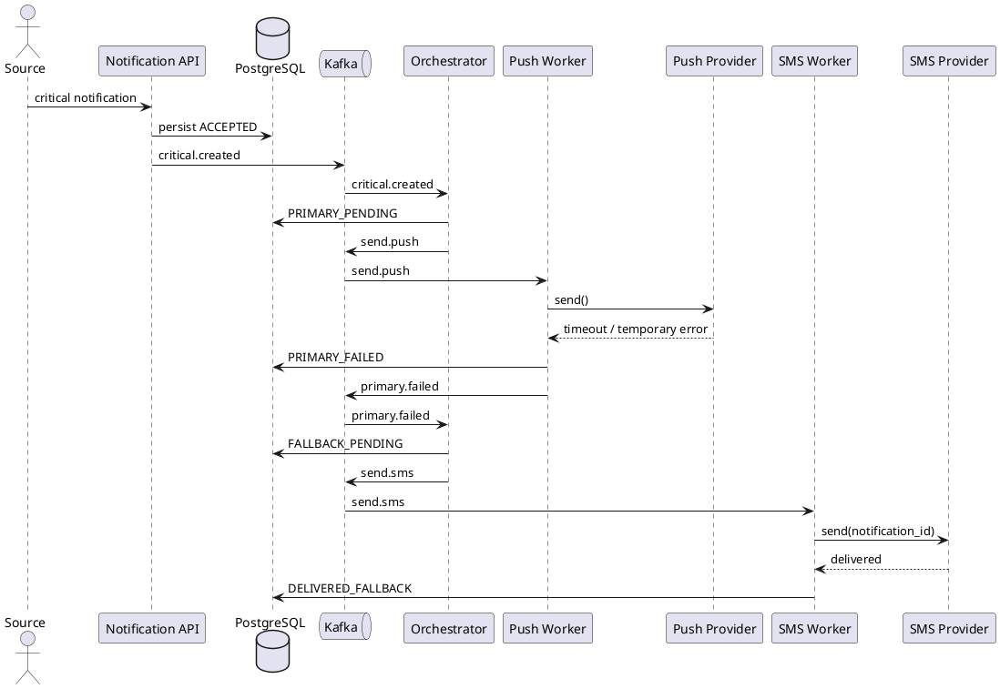
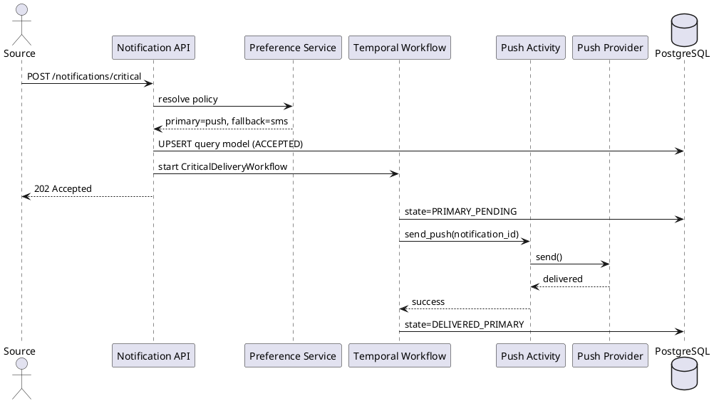
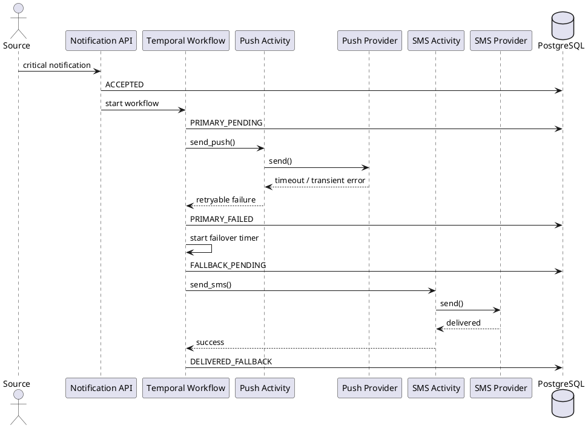

# RFC: Проектирование механизма гарантированной доставки критичных уведомлений с автоматическим failover между каналами доставки

| Метаданные | Значение |
|------------|----------|
| **Статус** | DESIGN |
| **Ответственный** | Команда Notification Platform |
| **Бизнес-заказчик** | Digital Banking / Customer Experience |
| **Ревьюеры** | Архитектор платформы, Тимлид канала уведомлений |
| **Дата создания** | 2026-04-07 |
| **Дата обновления** | 2026-04-07 |

---

## Оглавление

1. [Контекст](#контекст)
2. [Продуктовый анализ](#продуктовый-анализ)
3. [Пользовательские сценарии](#пользовательские-сценарии)
4. [Статистика](#статистика)
5. [Требования](#требования)
6. [Варианты решения](#варианты-решения)
7. [Сравнительный анализ](#сравнительный-анализ)
8. [Выводы](#выводы)
9. [Связанные задачи](#связанные-задачи)
10. [Приложения](#приложения)

---

## Контекст

В банке уже существует несколько продуктовых команд, и каждая отправляет уведомления самостоятельно. Из-за этого критичные сообщения о списании средств, подтверждении перевода и изменении статуса операции приходят неравномерно, иногда дублируются, а иногда не доходят вовсе. Для критичных транзакционных уведомлений это влияет не только на user experience, но и на доверие к банку: клиент должен быстро узнать, что деньги списаны или перевод подтвержден.

Подсистема гарантированной доставки нужна для критичных уведомлений внутри единой Notification Platform. Она должна обеспечивать три свойства одновременно:

1. сообщение не теряется после приема системой;
2. при отказе основного канала автоматически запускается резервный канал;
3. стоимость доставки остается контролируемой, поэтому дорогой SMS используется как fallback, а не как дефолт.

Ключевая проблема: каналы push, SMS и email имеют разную надежность, цену и семантику подтверждения доставки. Кроме того, внешние провайдеры могут отвечать с задержками, временно отказывать или присылать поздние receipt, когда failover уже стартовал.

### Ключевые вопросы

- Как гарантировать, что критичное уведомление будет доставлено хотя бы по одному каналу?
- Как сделать failover быстрым, но не порождать лишние дубликаты?
- Как не дать маркетинговой нагрузке сломать SLA критичных событий?

---

## Продуктовый анализ

### Бизнес-цели

- увеличить retention пользователей на 15% за счет предсказуемых и своевременных коммуникаций;
- снизить число жалоб на уведомления на 30%;
- гарантировать доставку критичных уведомлений хотя бы по одному доступному каналу.

### Продуктовые правила

1. **Транзакционные уведомления** обязательны для доставки и не могут быть полностью отключены пользователем.
2. **Сервисные уведомления** пользователь может отключать по каналам.
3. **Маркетинговые уведомления** пользователь может отключать полностью.
4. Для критичных уведомлений пользователь может выбрать **предпочтительный первичный канал**, но система вправе использовать резервный канал, если первичный не сработал.
5. Для пользователя должен быть доступен прозрачный статус: что отправлено, каким каналом и почему сработал fallback.

### Акторы

- продуктовый сервис-источник (например, сервис переводов);
- клиент банка;
- оператор поддержки / SRE;
- внешние провайдеры push, SMS и email.

---

## Пользовательские сценарии

| Приоритет | Тип сценария | Действующее лицо | Сценарий |
|-----------|--------------|------------------|----------|
| MUST HAVE | Транзакционный | Сервис переводов | После успешного перевода система отправляет подтверждение, и клиент получает его почти мгновенно. |
| MUST HAVE | Транзакционный | Клиент банка | Если push не доставлен вовремя, уведомление автоматически уходит по SMS без участия пользователя. |
| MUST HAVE | Операционный | Оператор поддержки | Оператор видит по notification_id, через какой канал было доставлено сообщение, были ли retries и почему запустился failover. |
| SHOULD HAVE | Настройки | Клиент банка | Пользователь выбирает предпочитаемый канал для критичных уведомлений: push или SMS, если доступны оба. |
| SHOULD HAVE | Стоимость | Команда платформы | Система старается сначала использовать дешевый канал push и только затем переходить к SMS. |
| COULD HAVE | Аналитика | Продуктовая команда | Команда получает агрегированные метрики по успеху доставки и частоте failover по каждому типу событий. |

---

## Статистика

### Исходные данные

- MAU: 10 млн.
- DAU: 3 млн.
- Peak Concurrent Users: 300 000.
- Среднее число уведомлений на пользователя в день:
  - транзакционные: 2;
  - сервисные: 3;
  - маркетинговые: 5.

### Расчет нагрузки

- Всего уведомлений в день: `3 000 000 x 10 = 30 000 000`.
- Транзакционных в день: `3 000 000 x 2 = 6 000 000`.
- Средний общий поток: `30 000 000 / 86 400 ~= 347` уведомлений/сек.
- Средний поток критичных уведомлений: `6 000 000 / 86 400 ~= 69` уведомлений/сек.
- Пиковый коэффициент для дневного трафика по транзакционным + сервисным: `x15`.
- Пиковый поток транзакционных + сервисных: `173 x 15 ~= 2 595` уведомлений/сек.
- Массовая кампания 1 млн пользователей за 15 минут: `1 111` уведомлений/сек.
- Целевой расчетный пик по входящему трафику всей платформы: `~3 700` уведомлений/сек.
- Для надежности проектируем подсистему на `4 000` входящих запросов/сек и `8 000` попыток доставки/сек с учетом failover, callback и retry.

### Специфика именно критичного контура

- Критичный контур проектируется с выделенным приоритетом и собственными очередями.
- Основной рабочий объем для него — до `1 100` входящих критичных уведомлений/сек в пике.
- С учетом failover и повторных попыток целевая емкость critical delivery pipeline — до `2 500` действий/сек.

---

## Требования

### Функциональные требования

| № | Приоритет | Обозначение | Требование |
|---|-----------|-------------|------------|
| 1 | MUST HAVE | FR1 | Подсистема должна принимать критичное уведомление с `notification_id`, типом события, payload и idempotency key. |
| 2 | MUST HAVE | FR2 | Подсистема должна выбирать primary и fallback каналы на основе правил критичности, пользовательских настроек и наличия верифицированных контактов. |
| 3 | MUST HAVE | FR3 | Если primary-канал отказал или не подтвердил доставку в допустимый срок, подсистема должна автоматически запускать fallback-канал. |
| 4 | MUST HAVE | FR4 | Подсистема должна хранить полную историю попыток доставки и возвращать итоговый статус по каждому уведомлению. |
| 5 | MUST HAVE | FR5 | Подсистема должна исключать повторную отправку одного и того же критичного уведомления при дубле запроса, retry или позднем callback. |
| 6 | SHOULD HAVE | FR6 | Подсистема должна уведомлять сервис-источник и аналитические системы о смене состояния доставки через события и webhook/API статусы. |
| 7 | SHOULD HAVE | FR7 | Подсистема должна уметь отменять или подавлять позднюю отправку по резервному каналу, если основной канал успел подтвердить доставку раньше фактической отправки fallback. |

### Нефункциональные требования

| № | Приоритет | Обозначение | Требование |
|---|-----------|-------------|------------|
| 1 | MUST HAVE | NFR1 | Время от приема критичного уведомления до первой попытки доставки: `<= 1 c` по p95 и `<= 2 c` по p99. |
| 2 | MUST HAVE | NFR2 | Время от фиксации неуспеха или timeout primary-канала до старта fallback: `<= 3 c` по p95. |
| 3 | MUST HAVE | NFR3 | Доля критичных уведомлений, доставленных хотя бы по одному каналу в течение `60 c`, должна быть `>= 99,95%`, если хотя бы один канал и один провайдер доступны. |
| 4 | MUST HAVE | NFR4 | Потеря принятого системой критичного уведомления недопустима: `0` потерянных уведомлений после durable-ack. |
| 5 | MUST HAVE | NFR5 | Доля видимых кросс-канальных дубликатов для одного `notification_id` должна быть `< 0,1%`. |
| 6 | MUST HAVE | NFR6 | Подсистема должна выдерживать `1 100` критичных уведомлений/сек на вход и `2 500` действий/сек в контуре доставки. |
| 7 | SHOULD HAVE | NFR7 | Доля SMS как fallback для критичных уведомлений не должна превышать `15%` от числа критичных отправок в нормальном режиме. |
| 8 | MUST HAVE | NFR8 | 100% событий должны быть доступны в логах, метриках и трассировках с `notification_id` и `correlation_id`, а задержка обновления операционных метрик должна быть не более `30 c`. |

### Архитектурно значимые требования (ASR)

#### ASR-1 (P1). Гарантированная доставка хотя бы по одному каналу

**Связанные требования:** FR2, FR3, FR4, NFR2, NFR3, NFR4.

**Почему влияет на архитектуру:** требуется durable storage состояния, таймеры, управление переходами state machine, независимость от отдельного провайдера и резервирование каналов.

#### ASR-2 (P1). Низкая задержка и предсказуемый SLA для критичных уведомлений

**Связанные требования:** FR1, NFR1, NFR2, NFR6.

**Почему влияет на архитектуру:** заставляет минимизировать синхронную часть пользовательского пути и выделять отдельный pipeline/очереди под критичные события.

#### ASR-3 (P1). Идемпотентность и защита от дубликатов при failover

**Связанные требования:** FR5, FR7, NFR5.

**Почему влияет на архитектуру:** требует централизованной модели статусов, уникальных ключей попыток, дедупликации callback и контроля гонок между primary и fallback.

#### ASR-4 (P2). Наблюдаемость и аудит

**Связанные требования:** FR4, FR6, NFR8.

**Почему влияет на архитектуру:** нужна единая схема событий, трассировки, аудит-лог и разрезы по каналам, провайдерам, таймаутам и failover.

---

## Варианты решения

### Вариант 1: Централизованный delivery orchestrator

> **Описание:** единый orchestrator хранит состояние уведомления в PostgreSQL, публикует задачи в Kafka и управляет таймерами failover. Канальные воркеры stateless, а источник истины по статусу находится в одной state machine.

#### Архитектура

**Технологии:**
- API приема: Litestar;
- durable state store: PostgreSQL;
- брокер: Kafka;
- cache / краткоживущий dedupe / rate limit: Redis;
- observability: OpenTelemetry + Prometheus + Grafana + Tempo;
- провайдеры: Firebase/APNs для push, внешний SMS gateway, email provider.

**C4 Container Diagram:**

```plantuml
@startuml
!theme plain
skinparam componentStyle rectangle
left to right direction

actor "Product Services" as Source
actor "Support/SRE" as Ops
cloud "Push Provider" as Push
cloud "SMS Provider" as Sms
cloud "Email Provider" as Email

rectangle "Notification Platform" {
  component "Notification API
(Litestar)" as API
  component "Preference Service" as Prefs
  component "Delivery Orchestrator" as Orch
  queue "Kafka critical topics" as Kafka
  database "PostgreSQL
Delivery State" as Pg
  collections "Redis
Dedup/Cache" as Redis
  component "Push Worker" as PushWorker
  component "SMS Worker" as SmsWorker
  component "Email Worker" as EmailWorker
  component "Observability Stack" as Obs
}

Source --> API : create critical notification
API --> Prefs : load user policy
API --> Pg : persist notification + outbox
API --> Kafka : publish critical.created
Kafka --> Orch : consume event
Orch --> Pg : state transitions
Orch --> Kafka : dispatch primary/fallback tasks
Kafka --> PushWorker
Kafka --> SmsWorker
Kafka --> EmailWorker
PushWorker --> Push
SmsWorker --> Sms
EmailWorker --> Email
PushWorker --> Pg : result / receipt
SmsWorker --> Pg : result / receipt
EmailWorker --> Pg : result / receipt
Orch --> Redis : timers / short dedupe
Pg --> Obs : events/metrics
Kafka --> Obs : lag / throughput
Ops --> Obs : dashboards / alerts
@enduml
```

#### Основной сценарий доставки



#### Сценарий failover



#### Как вариант выполняет ASR

| ASR | Как выполняется |
|-----|------------------|
| ASR-1 | PostgreSQL хранит durable state; orchestrator запускает fallback по событию `primary.failed` или по таймеру timeout. |
| ASR-2 | Критичные события идут в отдельные Kafka topics и отдельный пул воркеров; API завершает синхронный путь после durable write. |
| ASR-3 | `notification_id` и `attempt_id` используются как идемпотентные ключи; поздние callback применяются только при допустимом переходе состояния. |
| ASR-4 | Все state transitions пишутся в БД и события observability; по каждому notification_id можно восстановить полную цепочку. |

#### Масштаб системы и ожидаемая нагрузка

- 32 партиции Kafka для critical topics;
- 8-16 orchestrator consumer instances;
- 20-40 канальных воркеров в зависимости от лимитов провайдеров;
- PostgreSQL в HA-конфигурации с read replica для операторских запросов;
- целевая емкость: `1 100` входящих critical req/s и `2 500` delivery actions/s.

#### Этапы реализации

| Этап | Описание | Планируемый срок | Ресурсы | Риски |
|------|----------|------------------|---------|-------|
| 1 | API приема, модель данных, Kafka topics, единый status model | 2 недели | 2 backend | Ошибки в схеме статусов |
| 2 | Push primary + SMS fallback + observability | 3 недели | 3 backend + 1 SRE | Неустойчивые provider SLA |
| 3 | Email fallback, операторские отчеты, оптимизация dedupe | 2 недели | 2 backend | Гонки при поздних receipt |

#### Преимущества

- единый источник истины по состоянию;
- проще контролировать дедупликацию и статусную модель;
- хорошо подходит под mixed workload всей платформы.

#### Недостатки

- значительная часть сложной логики реализуется самостоятельно;
- таймеры, retry и workflow-семантика требуют аккуратной разработки и тестирования;
- больше риск ошибок в custom orchestration code.

---

### Вариант 2: Temporal workflow для критичных уведомлений

> **Описание:** каждое критичное уведомление моделируется как durable workflow в Temporal. Workflow сам управляет порядком каналов, таймерами ожидания и запуском fallback, а канальные worker выполняют activities отправки.

#### Архитектура

**Технологии:**
- API приема: Litestar;
- workflow engine: Temporal;
- business-state / audit: PostgreSQL;
- cache настроек: Redis;
- observability: OpenTelemetry + Prometheus + Grafana;
- канальные activity workers: Python;
- провайдеры: Firebase/APNs, SMS gateway, email provider.

**C4 Container Diagram:**

```plantuml
@startuml
!theme plain
skinparam componentStyle rectangle
left to right direction

actor "Product Services" as Source
actor "Support/SRE" as Ops
cloud "Push Provider" as Push
cloud "SMS Provider" as Sms
cloud "Email Provider" as Email

rectangle "Notification Platform" {
  component "Notification API
(Litestar)" as API
  component "Preference Service" as Prefs
  component "Temporal Cluster" as Temporal
  component "Workflow Worker
CriticalDeliveryWorkflow" as WorkflowWorker
  component "Push Activity Worker" as PushWorker
  component "SMS Activity Worker" as SmsWorker
  component "Email Activity Worker" as EmailWorker
  database "PostgreSQL
Audit + Query Model" as Pg
  collections "Redis
Preference Cache" as Redis
  component "Observability Stack" as Obs
}

Source --> API : create critical notification
API --> Prefs : resolve policy
API --> Temporal : start workflow(notification_id)
API --> Pg : write query model
Temporal --> WorkflowWorker : schedule workflow task
WorkflowWorker --> PushWorker : execute push activity
WorkflowWorker --> SmsWorker : execute sms fallback
WorkflowWorker --> EmailWorker : execute email fallback
PushWorker --> Push
SmsWorker --> Sms
EmailWorker --> Email
WorkflowWorker --> Pg : audit state transitions
Prefs --> Redis : hot cache
Pg --> Obs : metrics/events
Temporal --> Obs : workflow metrics
Ops --> Obs : dashboards / alerts
@enduml
```

#### Основной сценарий доставки



#### Сценарий failover



#### Как вариант выполняет ASR

| ASR | Как выполняется |
|-----|------------------|
| ASR-1 | Workflow history и durable timers Temporal позволяют безопасно переживать рестарты и запускать fallback по таймеру или ошибке activity. |
| ASR-2 | Критичный контур вынесен в отдельный task queue; workflow координирует только критичные уведомления и не конкурирует с маркетинговыми очередями. |
| ASR-3 | Workflow ID = `notification_id`; повторный старт с тем же ID не создает новую оркестрацию, а activities идемпотентны. |
| ASR-4 | Temporal дает историю workflow, а PostgreSQL хранит query model и аудит для операторских интерфейсов. |

#### Масштаб системы и ожидаемая нагрузка

- отдельный Temporal namespace и task queue для critical delivery;
- 10-20 workflow workers;
- 20-40 activity workers по каналам;
- PostgreSQL для query model и operator read path;
- целевая емкость: `1 100` входящих critical req/s и `2 500` действий/сек, при этом количество открытых workflow равно числу активных уведомлений в окне до 60 секунд.

#### Этапы реализации

| Этап | Описание | Планируемый срок | Ресурсы | Риски |
|------|----------|------------------|---------|-------|
| 1 | Поднять Temporal namespace, описать workflow/state model | 2 недели | 2 backend + 1 platform | Новый инфраструктурный компонент |
| 2 | Реализовать push activity, SMS fallback, query model, метрики | 3 недели | 3 backend + 1 SRE | Ошибки в семантике retry/activity timeout |
| 3 | Email fallback, operator UI, cost tuning | 2 недели | 2 backend | Рост стоимости эксплуатации |

#### Преимущества

- готовые durable timers, retries и workflow history;
- ниже риск ошибки в логике orchestration;
- проще развивать сложные failover-сценарии и политики эскалации.

#### Недостатки

- появляется отдельная технологическая платформа, которую нужно сопровождать;
- команде нужен опыт эксплуатации Temporal;
- для operator query path все равно нужен отдельный read model.

---

## Сравнительный анализ

### Ресурсные требования

| Критерий | Вариант 1 | Вариант 2 |
|----------|-----------|-----------|
| Время реализации | 7 недель | 7 недель |
| Команда | 3 backend + 1 SRE | 3 backend + 1 SRE + 1 platform engineer |
| Инфраструктура | Kafka, PostgreSQL, Redis | Temporal, PostgreSQL, Redis |
| Операционная сложность | Средняя | Выше средней |
| Риск ошибки в orchestration code | Высокий | Средний |
| Гибкость под весь mixed workload | Высокая | Средняя |
| Удобство для сложных таймеров и failover | Среднее | Высокое |

### Соответствие требованиям

| Требование | Вариант 1 | Вариант 2 |
|------------|-----------|-----------|
| FR1 | ✅ Да | ✅ Да |
| FR2 | ✅ Да | ✅ Да |
| FR3 | ✅ Да | ✅ Да |
| FR4 | ✅ Да | ✅ Да |
| FR5 | ✅ Да | ✅ Да |
| NFR1 | ✅ Да | ✅ Да |
| NFR2 | ✅ Да | ✅ Да |
| NFR3 | ✅ Да | ✅ Да |
| NFR4 | ✅ Да | ✅ Да |
| NFR5 | ✅ Да | ✅ Да |
| NFR6 | ✅ Да | ✅ Да |
| NFR8 | ✅ Да | ✅ Да |

### Trade-off summary

| Критерий | Вариант 1 | Вариант 2 |
|----------|-----------|-----------|
| Контроль над всей платформой уведомлений | Лучше | Хуже |
| Скорость безопасной реализации failover для критичных уведомлений | Хуже | Лучше |
| Стоимость поддержки | Ниже | Выше |
| Простота доказательства корректности | Хуже | Лучше |
| Удобство расширения до 3+ шагов эскалации | Среднее | Высокое |

---

## Выводы

> **Рекомендация:** выбрать **Вариант 2 — Temporal workflow для критичных уведомлений**, а некритичные сервисные и маркетинговые сценарии оставить в более простом event-driven pipeline общей Notification Platform.

### Обоснование выбора

Для данного RFC мы проектируем не всю платформу, а именно самый сложный и рискованный контур — гарантированную доставку критичных транзакционных уведомлений с failover. Здесь главным источником сложности являются durable timers, корректные retry/failover-переходы, защита от дубликатов и необходимость разбирать инциденты по каждому уведомлению. Temporal закрывает эту проблематику лучше, чем самописный orchestrator:

1. **Надежнее реализуются таймеры и ожидание результата канала.** Не нужно самостоятельно строить сложную механику таймаутов, восстановления после рестартов и повторного запуска задач.
2. **Проще обеспечить корректность failover.** Workflow history дает понятную модель состояний и снижает риск гонок между late receipt от primary-канала и уже запущенным fallback.
3. **Лучше наблюдаемость и разбор инцидентов.** История workflow плюс query model в PostgreSQL дает и инженерную, и операционную трассировку.
4. **Нагрузка подходит под подход.** Критичный контур имеет умеренный объем относительно всей платформы; выделенный workflow-движок для него экономически оправдан.

### Компромиссы и ограничения

- решение дороже в эксплуатации, чем custom orchestrator;
- требуется platform/SRE-экспертиза по Temporal;
- абсолютное отсутствие кросс-канальных дублей недостижимо при внешних провайдерах с неидеальными ack, поэтому фиксируем реалистичную цель: `visible duplicate rate < 0,1%` и максимально подавляем поздние отправки.

### Что остается за рамками RFC

- точный выбор конкретного SMS/email провайдера;
- UI операторского кабинета;
- маршрутизация маркетинговых кампаний и full-platform оркестрация всех типов уведомлений.

---

## Связанные задачи

- Подключить минимум двух независимых SMS-провайдеров и выполнить сравнительный pilot по SLA.
- Реализовать operator query API и поиск по `notification_id`, `user_id`, `provider_message_id`.
- Провести нагрузочное тестирование critical pipeline на `1 100` req/s и `2 500` delivery actions/s.

---

## Приложения

### Глоссарий

| Термин | Определение |
|--------|-------------|
| Critical notification | Критичное транзакционное уведомление, недоставка которого влияет на UX и доверие пользователя |
| Primary channel | Канал, в который система отправляет уведомление первым |
| Fallback channel | Резервный канал, запускаемый после ошибки или timeout основного |
| Failover | Автоматическое переключение доставки на резервный канал |
| Idempotency key | Ключ, позволяющий безопасно обработать повторный запрос без повторной пользовательской отправки |
| Query model | Отдельная read-модель для операторских запросов и отчетов |
